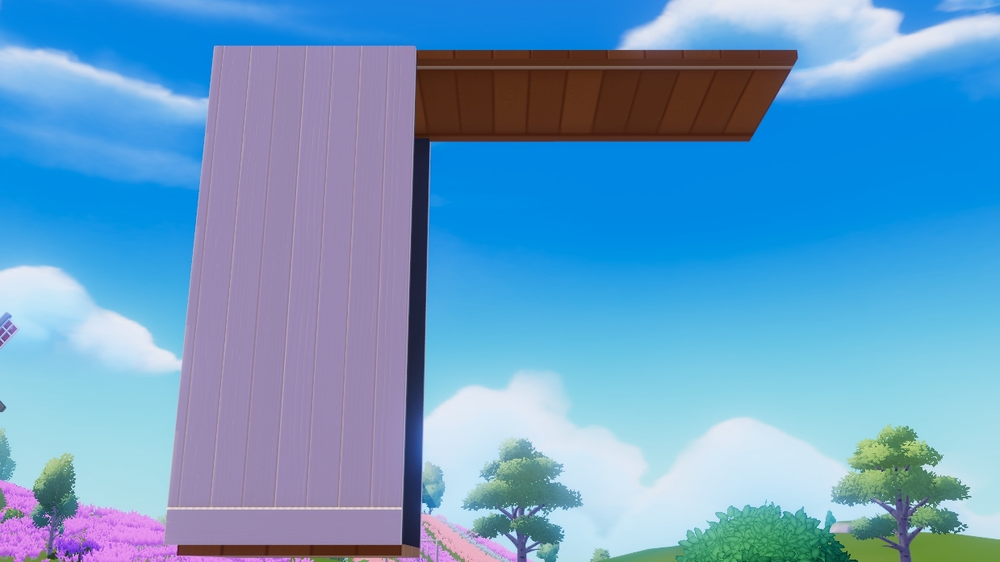
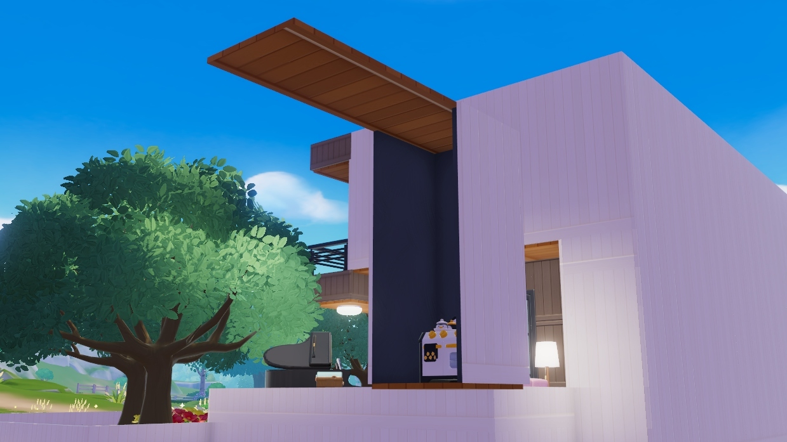
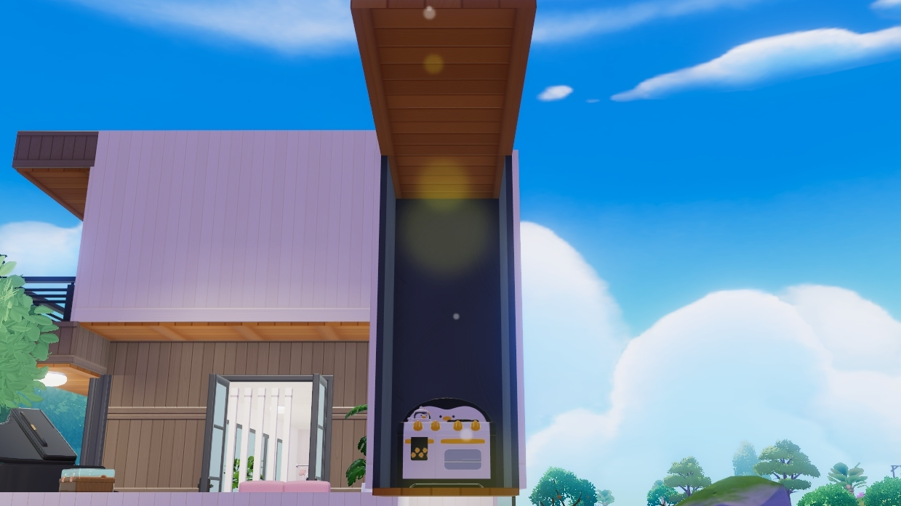

# Auto Aurora Banquet Cooker

Tired of cooking banquets manually and constantly worrying about ratios? This script automates the process for you.  

> **WARNING:** Use at your own risk. Macros **can be considered a bannable offense**. I take no responsibility for any consequences.

---

## How It Works

The script uses **image recognition** to detect ovens and automatically manage cooking. To improve reliability, follow these setup tips:

### 1. Dark Walls
Surround your oven with dark walls. This makes image recognition more accurate. Black walls are ideal.  

### 2. Long Roof
Be aware of sunlight and lens flare—it can interfere with detection. A long roof helps reduce this issue.  

### 3. Single Floor
Keep your oven area on a single floor to avoid interference from pets or other moving objects.

---

## Example Builds

Here are some setups that work well:  

  
  

